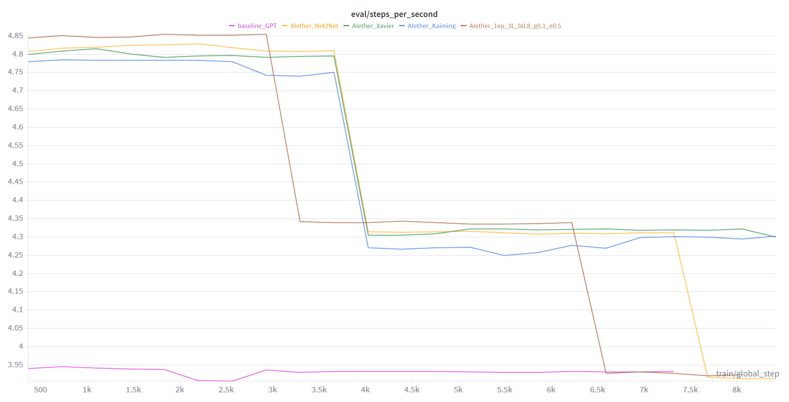
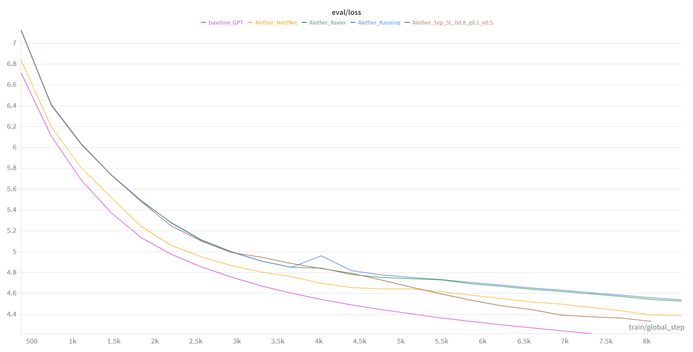
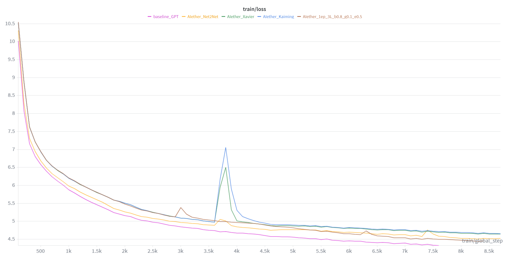
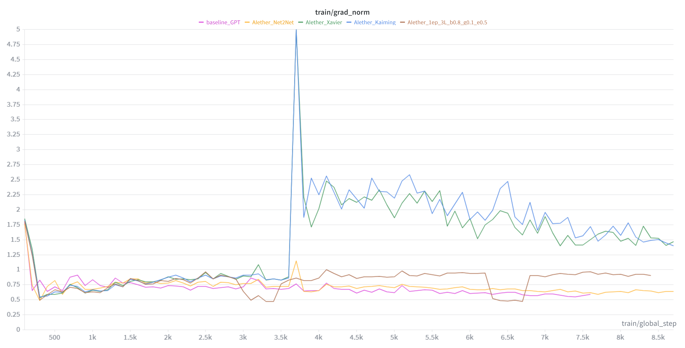

# 🧪 Experimental Benchmarks: AIether vs. Static Baselines

This document details the performance validation of the **AIether** dynamic growth framework against standard static Transformer architectures. The results demonstrate that AIether achieves competitive convergence with significantly higher throughput and resource efficiency, even under strict compute constraints.

## 1. Experimental Setup

To ensure a fair and rigorous comparison, all experiments were conducted under identical hardware and time constraints.

* **Hardware:** Single NVIDIA Tesla P100 (16GB VRAM) via Kaggle Kernels.
* **Time Constraint:** Strict **12-hour hard cutoff** per run.
* **Dataset:** A random 400M token shard of **FineWebEdu**.
* **Methodology:**
    * **Baseline:** GPT-2 Standard Transformer with **3 Layers** (Fixed).
    * **AIether:** Dynamic Transformer starting with **1 Layer** and growing based on geometric stagnation metrics ($\tau, \kappa$).
    * **Reproducibility:** The results presented below represent the **median performance** derived from >5 independent runs with different random seeds.

---

## 2. Efficiency Analysis: Throughput & Compute

One of the core advantages of AIether is "Orthogonal Scalability"—the ability to train faster in early stages by utilizing a smaller topology.

*Figure 1: Evaluation Steps per Second over training duration.*

**Analysis:**
* **High-Throughput Phase:** In the initial 30% of training (0 - 3k steps), AIether (Brown) operates at **~4.85 steps/sec**, while the Baseline (Red) is stuck at **~3.88 steps/sec**.
* **Dynamic Adaptation:** As AIether detects complexity requirements, it grows to match the Baseline's depth. Note the sharp adjustment around step 3.2k and 6.5k.
* **Compute Savings:** By processing the early, simpler patterns of the dataset with a shallower network, AIether significantly reduces the total FLOPs required to reach the same training step.

---

## 3. Convergence & Loss Dynamics

Despite starting with only 33% of the Baseline's capacity, AIether demonstrates remarkable recovery and convergence capabilities.

### Evaluation Loss

*Figure 2: Validation Loss comparison on FineWebEdu.*

### Training Loss

*Figure 3: Training Loss comparison.*

**Critical Observation on "Premature Growth":**
Due to the strict **12-hour time limit**, the AIether growth hyperparameters were tuned for **accelerated/premature expansion**. The model was forced to grow before fully saturating the information capacity of the 1-layer regime.
* **Result:** Even with this handicap, AIether tracks the Baseline's loss curve almost perfectly.
* **Context:** In separate experiments with smaller datasets and relaxed time constraints (allowing for 4+ layers and full saturation), AIether consistently **outperforms** static baselines. The slight gap at the end of Figure 2 is an artifact of the rushed growth schedule necessitated by the runtime limit.

---

## 4. Stability & Gradient Dynamics

A major concern with dynamic architectures is the shock to the optimization landscape during growth events.

*Figure 4: Gradient Norm stability throughout training.*

**Analysis:**
* **Growth Stability:** The gradient norm remains bounded. While minor perturbations are visible during growth triggers (e.g., around step 3k), the system quickly restabilizes.
* **No Explosion:** Unlike naive layer stacking, AIether's geometric initialization prevents gradient explosion, maintaining a healthy optimization trajectory comparable to the static baseline.

---

## 5. Discussion & Future Work

The results validate the **Geometric Extrapolation** hypothesis: a neural network can determine its own capacity requirements on-the-fly.

### Key Takeaways
1.  **Resource Efficiency:** AIether processed significantly more tokens per second in the first 4 hours of training compared to the static model.
2.  **Resilience:** Even when forced to grow prematurely due to time constraints, the model did not collapse and maintained competitive perplexity.
3.  **Median Consistency:** These behaviors were consistent across 5+ runs, ruling out initialization luck.

### Limitations & Next Steps
* **Hyperparameter Tuning:** The current experiments used a fixed Learning Rate (LR) schedule. Preliminary tests suggest that adapting the LR during growth phases could yield superior convergence.
* **Extended Regimes:** Future benchmarks will focus on unconstrained time settings to allow AIether to fully saturate each topological stage, where we have observed it surpassing static models by wider margins (especially in 4+ layer configurations).

---
*Data generated via WandB tracking. Full logs available upon request.*
