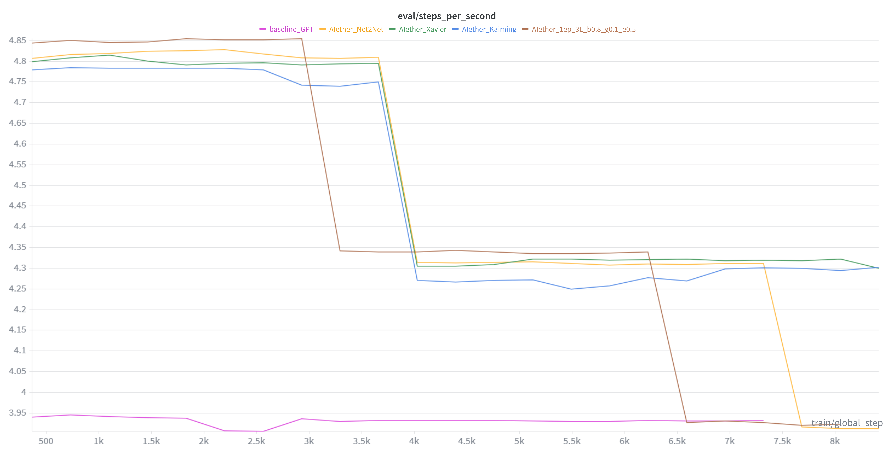
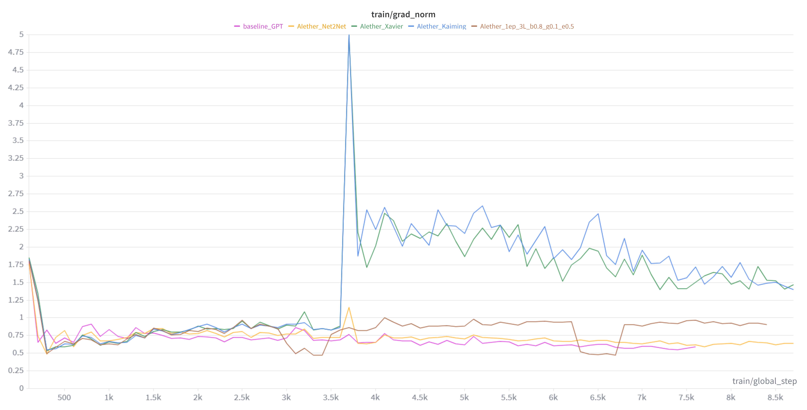
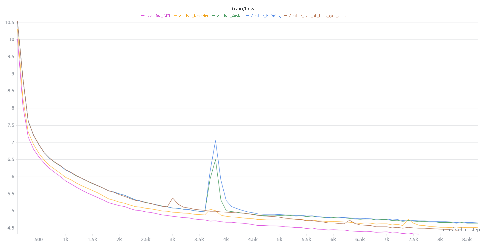
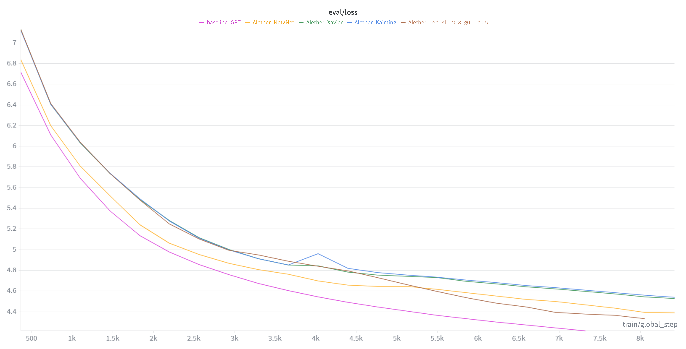
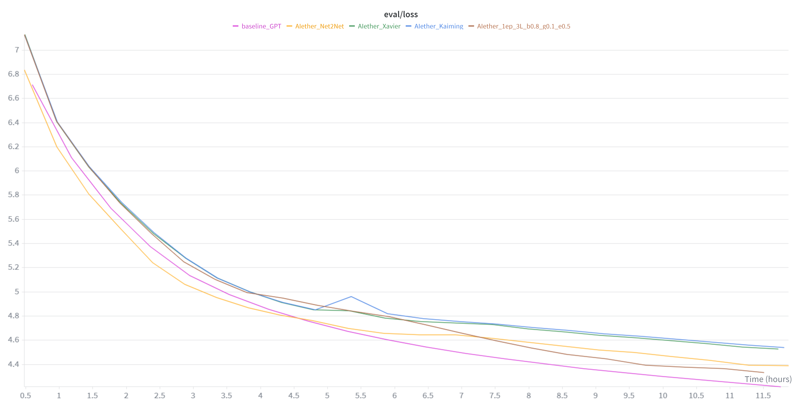

# 🧪 Experimental Benchmarks: AIether vs. Static Baselines & Ablation Study

This document details the performance validation of the **AIether** dynamic growth framework against standard static Transformer architectures, as well as an ablation study comparing our Geometric Extrapolation against naive initialization methods (Xavier, Kaiming, and Net2Net).

The results empirically demonstrate that AIether not only achieves competitive convergence with significantly higher throughput but also effectively mitigates the "Initialization Shock" (Gradient Explosion) typical of procedural architecture growth.

## 1. Experimental Setup

To ensure a fair and rigorous comparison, all experiments were conducted under identical hardware constraints.

* **Hardware:** Single NVIDIA Tesla P100 (16GB VRAM)
* **Dataset:** A random 400M token shard of **FineWebEdu**.
* **Methodology:**
    * **Baseline (`baseline_GPT` - Magenta):** GPT-2 Standard Transformer (Static).
    * **AIether Variants:** Dynamic Transformers starting with a minimal topology and growing procedurally based on stagnation metrics. We tested multiple initialization strategies for the new layers:
        * `AIether_Xavier` (Green) & `AIether_Kaiming` (Blue): Naive matrix initializations.
        * `AIether_Net2Net` (Yellow): Identity-preserving initialization.
        * `AIether_Geometric` (Brown - *Our Method*): Adaptive Geometric Extrapolation ($\beta, \gamma, \eta$).

---

## 2. Efficiency Analysis: The "Orthogonal Scalability"

One of the core advantages of AIether is the ability to train faster in early stages by utilizing a smaller topology to process fundamental dataset patterns.

*Figure 1: Evaluation Steps per Second over training duration.*

**Analysis:**
* **High-Throughput Phase:** In the initial phase (0 - 3k steps), all AIether variants operate at **~4.85 steps/sec**, while the static Baseline is bottlenecked at **~3.95 steps/sec**.
* **Procedural Step-Downs:** The sharp drops in throughput (e.g., at steps 3k, 3.8k, and 6.5k) visualize the exact moments the AIether framework dynamically injects new layers into the architecture.
* **Compute Savings:** By processing early epochs with a shallower network, AIether translates this raw speed into executing significantly more optimization steps within the same time budget.

---

## 3. The "Initialization Shock": Gradient Stability

A major barrier to dynamic neural network growth is the shock to the optimization landscape when untrained parameters are suddenly injected into a converging model. This ablation study proves the robustness of our framework.

*Figure 2: Gradient Norm stability throughout training.*

*Figure 3: Training Loss dynamics during layer injection.*

**Critical Observation:**
* **Catastrophic Forgetting in Naive Methods:** Notice the massive spikes in both `train/loss` and `train/grad_norm` for the Kaiming (Blue) and Xavier (Green) initializations around step 3.7k. The gradient norm violently spikes to $\approx 5.0$, severely disrupting the optimizer's momentum.
* **Geometric Stability (Our Method):** The AIether Geometric approach (Brown) and Net2Net (Yellow) maintain strict gradient boundedness during their respective growth triggers. Our tensor-wise extrapolation correctly positions the new layer's parameters in a mathematically informed subspace, allowing the network to grow without destroying previously learned representations.

---

## 4. Convergence & Time Dynamics

Despite starting with a fraction of the baseline's parameter count and undergoing multiple architectural disruptions, AIether demonstrates remarkable convergence capabilities.

*Figure 4: Validation Loss over Optimization Steps.*

*Figure 5: Validation Loss over Wall-Clock Time (Hours).*

**Analysis:**
* **Trajectory Recovery:** While the static Baseline maintains the lowest absolute loss at a given *step* (as it possesses full capacity from step 0), the AIether models successfully track its convergence curve. 
* **Time Competitiveness:** When evaluated over continuous time (Figure 5), AIether's early throughput advantage compensates for its smaller initial capacity. The geometric variant establishes a highly competitive loss frontier, proving that the computational savings in the early phases are not nullified by the growth process.

## 5. Conclusion
These benchmarks validate that **Geometric Extrapolation** allows a neural network to determine its own capacity requirements on-the-fly, yielding up to a 20% throughput increase in early training phases while mathematically neutralizing the gradient explosion typically associated with dynamic architecture expansion.
